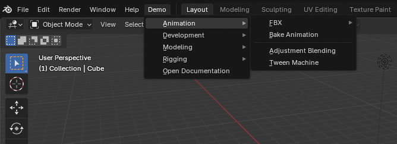

# Examples

This section build the [`demo_model`][menuet.demo.demo_model] in different
applications.

## QApplication

```python { .copy }
from PySide6 import QtWidgets

from menuet.builders.qt import QMenuBuilder
from menuet.demo import demo_model

app = QtWidgets.QApplication([])

model = demo_model()
builder = QMenuBuilder(model, root_menu="Demo")
menu = builder.build()

window = QtWidgets.QMainWindow()
window.menuBar().addMenu(menu)
window.show()

app.exec()
```

/// html | div.result.center


///

## Blender

```python { .copy }
import bpy

from menuet.builders.blender import BlenderMenuBuilder
from menuet.demo import demo_model

model = demo_model()
builder = BlenderMenuBuilder(model, root_menu="Demo")
menu = builder.build()

def menu_draw(self: bpy.types.Menu, context: bpy.types.Context) -> None:
    self.layout.menu(menu.bl_idname)

bpy.types.TOPBAR_MT_editor_menus.append(menu_draw)
```

/// html | div.result.center



///

## Text

```python { .copy }
from menuet.builders.text import Render, TextMenuBuilder
from menuet.demo import demo_model

model = demo_model()
builder = TextMenuBuilder(model, root_menu="Demo", render=Render.UTF8)
menu = builder.build()

print(menu)
```

/// html | div.result

```text
Demo
├── Animation
│   ├── FBX
│   │   ├── FBX Animation Exporter
│   │   └── FBX Animation Importer
│   ├── Bake Animation
│   ├── Edit ───
│   ├── Adjustment Blending
│   └── Tween Machine
├── Development
│   └── Start Debugger
├── Modeling
│   ├── Mesh Cleaner
│   ├── Mesh Randomizer
│   └── Mirror Geometry
├── Rigging
│   ├── Joint Tools
│   ├── Skinning Tools
│   ├── Controller ───
│   ├── Controller Creator
│   └── Controller Editor
└── Open Documentation
```

///
