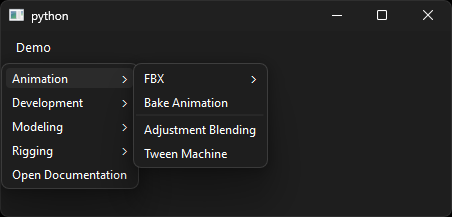
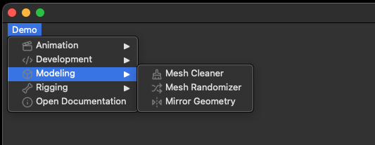
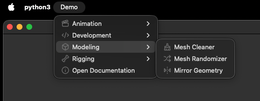
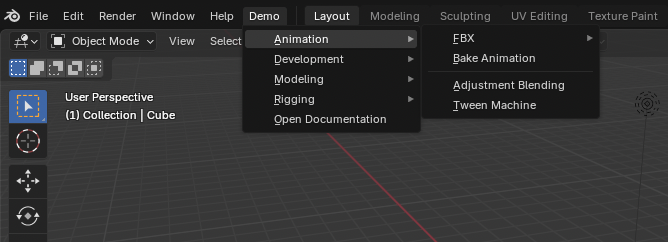

# Examples

This section build the [`demo_model`][menuet.demo.demo_model] in different
applications.

## QApplication

```python { .copy }
--8<-- "docs/assets/demo_qtapp.py"
```

/// html | div.result

**Windows:**



**macOS:**



**macOS native:**



///

## Blender

```python { .copy }
--8<-- "docs/assets/demo_blender.py"
```

/// html | div.result



///

## Text

```python { .copy }
from menuet.builders.text import Render, TextMenuBuilder
from menuet.demo import demo_model

model = demo_model()
builder = TextMenuBuilder(model, root_menu="Demo", render=Render.UTF8)
menu = builder.build()

print(menu)
```

/// html | div.result

```text
Demo
├── Animation
│   ├── FBX
│   │   ├── FBX Animation Exporter
│   │   └── FBX Animation Importer
│   ├── Bake Animation
│   ├── Edit ───
│   ├── Adjustment Blending
│   └── Tween Machine
├── Development
│   └── Start Debugger
├── Modeling
│   ├── Mesh Cleaner
│   ├── Mesh Randomizer
│   └── Mirror Geometry
├── Rigging
│   ├── Joint Tools
│   ├── Skinning Tools
│   ├── Controller ───
│   ├── Controller Creator
│   └── Controller Editor
└── Open Documentation
```

///
