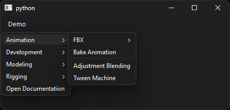
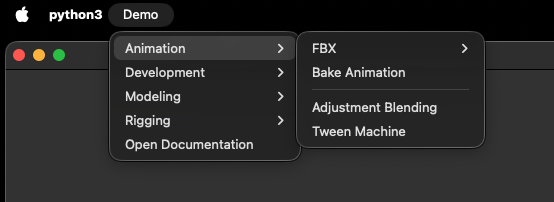

# Examples

This section build the [`demo_model`][menuet.demo.demo_model] in different
applications.

## QApplication

```python { .copy }
from PySide6 import QtWidgets

from menuet.builders.qt import QMenuBuilder
from menuet.demo import demo_model

app = QtWidgets.QApplication([])

model = demo_model()
builder = QMenuBuilder(model, root_menu="Demo")
menu = builder.build()

window = QtWidgets.QMainWindow()
builder = QMenuBuilder(model, root_menu="Demo")
window.menuBar().addMenu(builder.build())
window.show()

app.exec()
```

/// html | div.result.center





///
