# Examples

This section build the [`demo_model`][menuet.demo.demo_model] in different
applications.

/// details | menuet/demo/menu.toml
    type: disclosure

```toml { .copy }
--8<-- "src/menuet/demo/menu.toml"
```

///

## 3ds Max

Build menu under 3ds Max main menu bar.

```python { .copy }
--8<-- "docs/assets/demo_max.py"
```

/// html | div.result

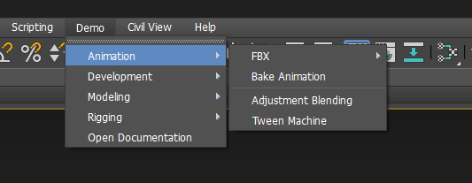

///

## Blender

```python { .copy }
--8<-- "docs/assets/demo_blender.py"
```

/// html | div.result

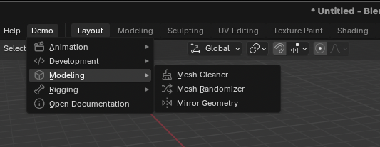

///

## Houdini

The following example generates a Houdini `XML` menu configuration in a
[Houdini startup script](https://www.sidefx.com/docs/houdini/hom/locations.html#startup)
and adds it to `HOUDINI_MENU_PATH`.

/// tip

The `startup/` directory must be added to the
[`HOUDINI_PATH`](https://www.sidefx.com/docs/houdini/basics/houdinipath.html)
variable.

```console
export HOUDINI_PATH="/path/to/startup:&"
```

The `&`
[special character](https://www.sidefx.com/docs/houdini/basics/config_env.html#special-characters-in-path-variables)
expands to the *default* path.

///

```python { .copy }
--8<-- "docs/assets/demo_houdini.py"
```

/// html | div.result

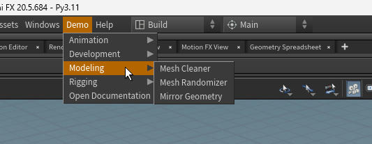

///

## Maya

Build menu under Maya main menu bar `"MayaWindow"`.

```python { .copy }
--8<-- "docs/assets/demo_maya.py"
```

/// html | div.result

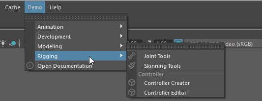

///

Maya menu builder can create `dragMenuCommand`
and `dragDoubleClickCommand` dynamically.

```python { .copy }
--8<-- "docs/assets/demo_maya_shelf.py"
```

/// html | div.result

To add a menu item to a shelf,
switch to the shelf where you want to add the menu item,
open the menu containing the item you want,
then `Ctrl + Shift + Click` the menu item.

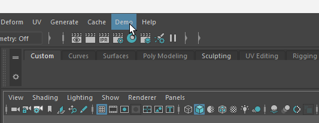

///

/// tip | Maya menus can also be built with the [`QMenuBuilder`][menuet.builders.qt.QMenuBuilder].

```python { .copy }
--8<-- "docs/assets/demo_mayaqt.py"
```

///

## Maya Marking Menu

Build a Maya Marking Menu triggered by holding `Ctrl-Shift-LeftMouseButton` in
the `"viewPanes"`.

```python { .copy }
--8<-- "docs/assets/demo_maya_marking_menu.py"
```

/// html | div.result

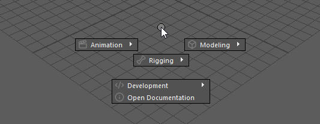

///

## MotionBuilder

Build menu under MotionBuilder main menu bar with the
[`QMenuBuilder`][menuet.builders.qt.QMenuBuilder].

```python { .copy }
--8<-- "docs/assets/demo_motionbuilder.py"
```

/// html | div.result

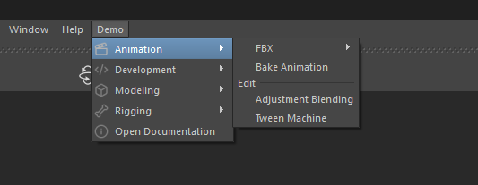

///

## Nuke

```python { .copy }
--8<-- "docs/assets/demo_nuke.py"
```

/// html | div.result

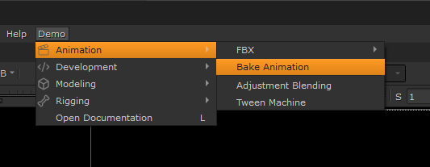

///

## QApplication

```python { .copy }
--8<-- "docs/assets/demo_qtapp.py"
```

/// html | div.result

**Windows:**

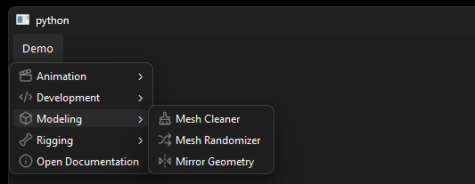

**macOS:**

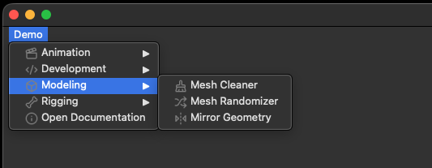

**macOS native:**

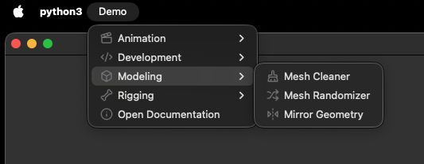

///

## Substance Designer

Build menu under Substance Designer main menu bar with the
[`QMenuBuilder`][menuet.builders.qt.QMenuBuilder].

```python { .copy }
--8<-- "docs/assets/demo_designer.py"
```

/// html | div.result

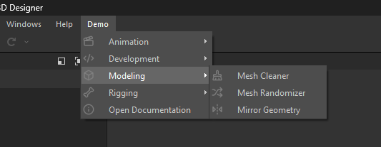

///

## Substance Painter

Build menu under Substance Painter main menu bar with the
[`QMenuBuilder`][menuet.builders.qt.QMenuBuilder].

```python { .copy }
--8<-- "docs/assets/demo_painter.py"
```

/// html | div.result

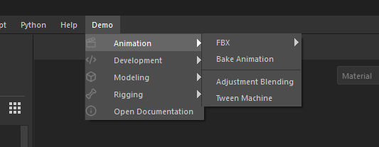

///

## Text

```python { .copy }
from menuet.builders.text import Render, TextMenuBuilder
from menuet.demo import demo_model

model = demo_model()
builder = TextMenuBuilder(model, root_menu="Demo", render=Render.UTF8)
menu = builder.build()

print(menu)
```

/// html | div.result

```text
Demo
├── Animation
│   ├── FBX
│   │   ├── FBX Animation Exporter
│   │   └── FBX Animation Importer
│   ├── Bake Animation
│   ├── Edit ───
│   ├── Adjustment Blending
│   └── Tween Machine
├── Development
│   └── Start Debugger
├── Modeling
│   ├── Mesh Cleaner
│   ├── Mesh Randomizer
│   └── Mirror Geometry
├── Rigging
│   ├── Joint Tools
│   ├── Skinning Tools
│   ├── Controller ───
│   ├── Controller Creator
│   └── Controller Editor
└── Open Documentation
```

///

## Unreal

```python { .copy }
--8<-- "docs/assets/demo_unreal.py"
```

/// html | div.result

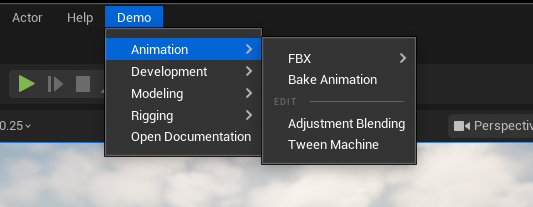

///
